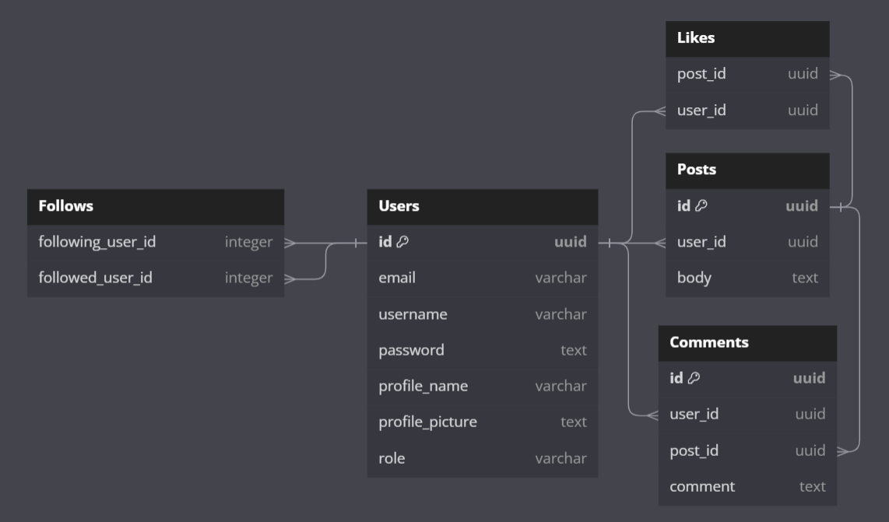

# Echo Server - The Bridge FS Final Project #


**Echo's server side repository.** [*Client Repository*](https://github.com/GREGORIOtsr/echo_client/)

Echo is a prototype social media project inspired in MySpace, Twitter and other social media apps. This repository contains the server structure of the project with express routing, SQL database connection, models and controllers with Sequelize and authentication with JWT.

[**Render deploy**](https://echo-server-04tc.onrender.com/)

## SQL Database ##

This project uses PostgreSQL and Sequelize to create the models, associations and controllers for the API.



## Express Routing ##

The API consist of CRUD routes for each table of the database and authentication routes to log in and register a new user. In the render deploy you can access the Get routes por each table.

## JWT Auth ##

User authentication is made with JWT. Through the '/login' route, after is verified that the user exist and the data sent is valid, the user can receive a token signed by JWT and stored in the cookies. This token can then be verified by the route '/currentuser' which will receive the token, decode it, check if the information is valid and then send a response with the user data.

### Instructions ###

To install all dependencies you must run the next command inside the /src folder:

```
cd src
npm install
```

This project contains seeds to feed the database, you can run it by using *inside the /src folder* the command:

```
npm run feed_db
```

## WIP project ##

There's still things to be done, all of the changes and future objectives can be found here:

- Google Auth
- Image hosting
- User profile data and other models
